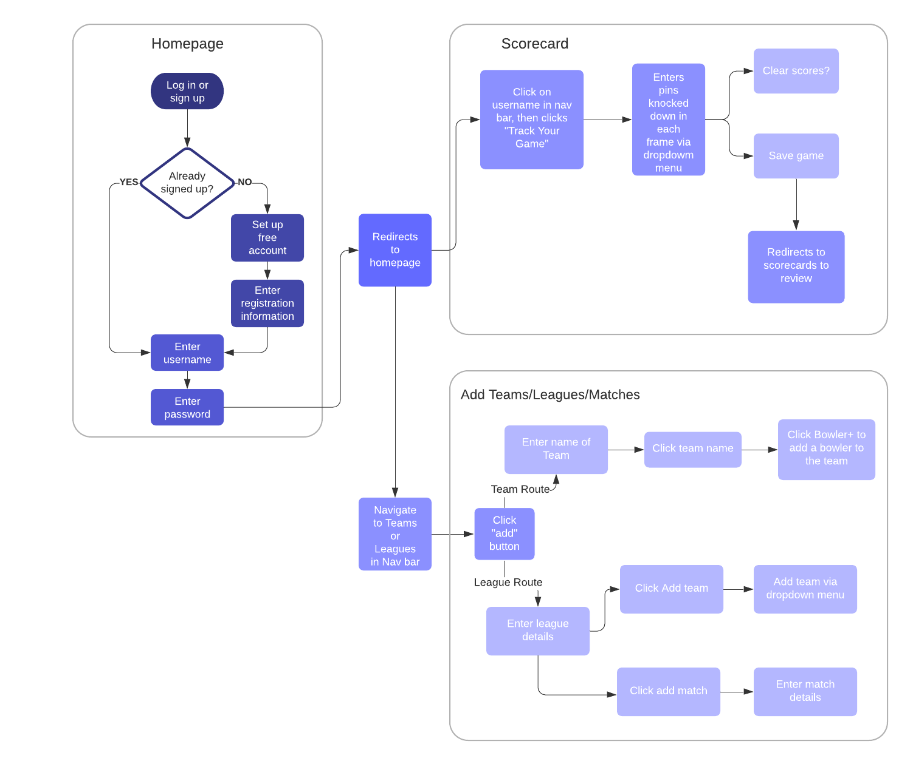

# Capstone 1: Bowling MVP

Link: https://bowling-mvp.herokuapp.com/

## Description

**Bowling MVP** is a web application that allows a user to track each game of bowling frame by frame. The user is then able to share the scorecards with other users who are registered on the applicaiton, allowing them to compare scores with themselves and with one another.

## Features

The main goal of **Bowling MVP** is to allow a user to track their game of bowling in order to assist with keeping a record of frames and scores.

Many people are unsure of how to calculate a bowling scorecard. **Bowling MVP** assists these users by calculating each frame for you by utilizing user input of how many pins were knocked down, if the frame is a strike, or if it is a spare.

The application consists of a database that allows users to create leagues and teams, associating users with teams and teams with leagues, setting a schedule of which teams are competing with one another on each league, and searching for nearby bowling alleys. These features were implemented in order to provide a user with a clean and organized way of storing and displaying information to a vast database of bowlers, teams, and leagues.

## Example User Flow

## Search API via MapQuest

Link: https://developer.mapquest.com/documentation/search-api/v4/swagger/

## Technologies Utilized

- HTML
- JavaScript
- CSS
- Bootstrap
- Python
- Flask
  - SQLAlchemy
  - WTForms
  - Jinja
  - Bcrypt
